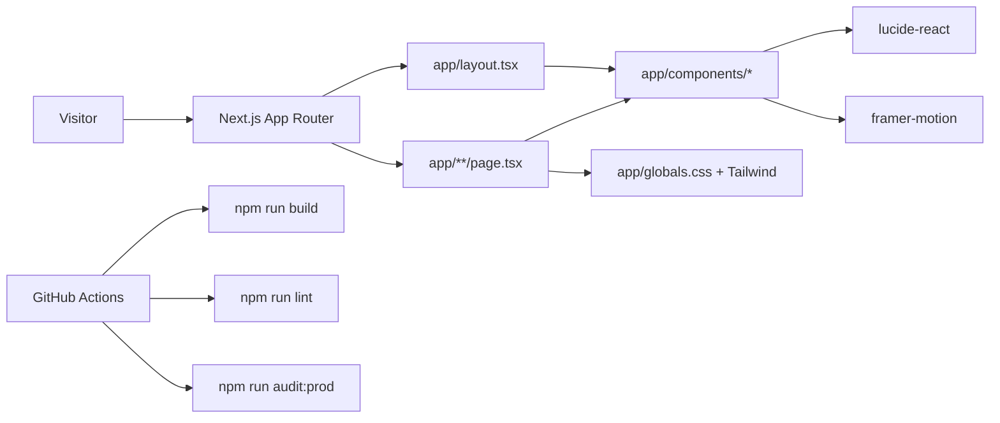

# Dependency Graph

This is a high-signal dependency map, not a complete import graph.

## High-Level Site

## Important Modules

| Module | Depends on | Notes |
| --- | --- | --- |
| `app/page.tsx` | React, Tailwind classes, shared/inline components | Main homepage and largest blast-radius file |
| `app/layout.tsx` | Global CSS, shared shell components | Controls global page shell and metadata |
| `app/components/Navbar.tsx` | Routing links, visual identity | High conversion and navigation impact |
| `app/components/Footer.tsx` if present | Legal/product links | Keep legal/conversion links accurate |
| `app/globals.css` | Tailwind/global styling | Wide visual impact |
| `package.json` | Next/npm scripts/deps | Build, lint, test, dependency audit behavior |
| `.github/workflows/dependency-security.yml` | npm scripts | CI quality gate |

## Largest Blast Radius

| Area | Why it is sensitive |
| --- | --- |
| Homepage hero and CTAs | Directly affects conversion and content tests |
| Navbar/footer | Site-wide navigation and trust impact |
| Global styles/Tailwind tokens | Can break layout, readability, mobile responsiveness |
| Product/compliance copy | Can create legal or sales risk if overclaimed |
| Package/dependency changes | Can break build, lint, or audit gate |

## Generated or Avoid Areas

- Do not manually edit `.next/`, `out/`, `node_modules/`, or Playwright output artifacts.
- Treat untracked/generated test artifacts as user/environment output unless explicitly asked to clean them.
