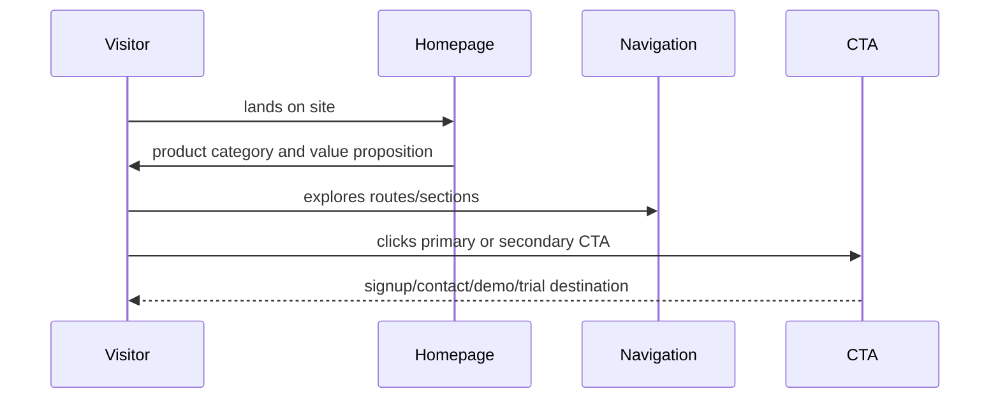
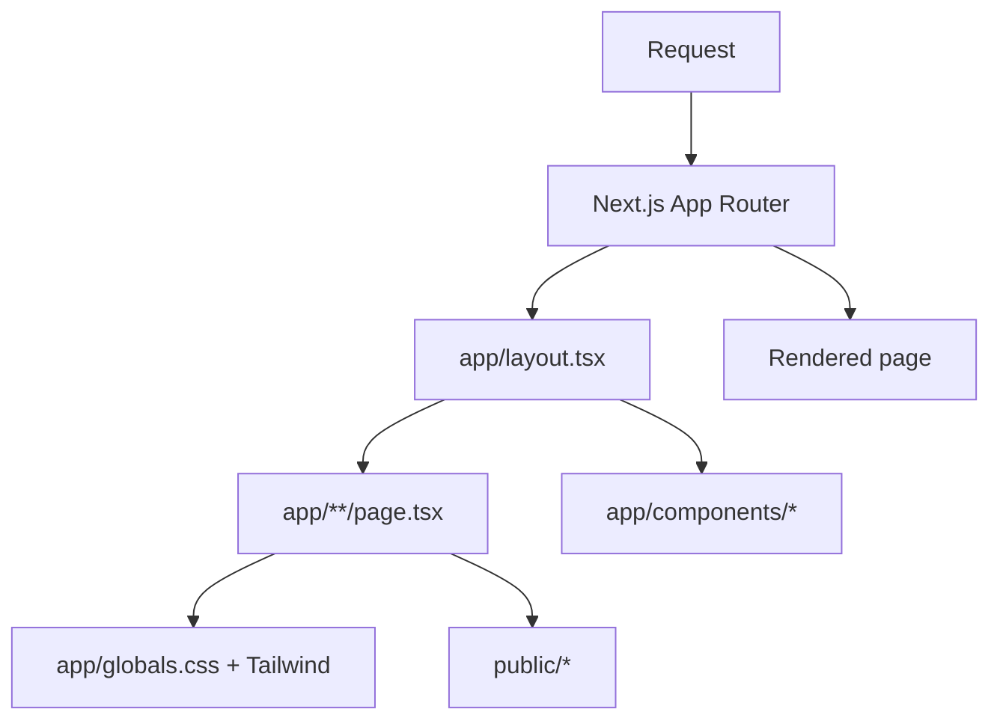
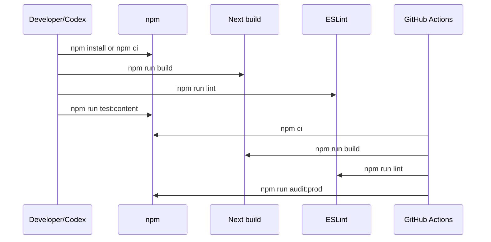
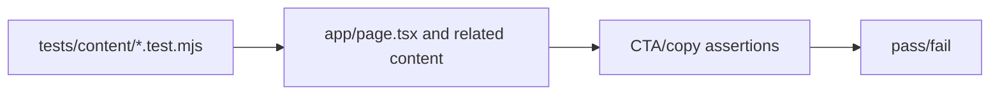

# Critical Flows

## 1. Visitor Conversion Flow

Notes:
- CTA labels and destinations should stay consistent across homepage, navbar, and content tests.
- Avoid adding claims that the gateway product cannot currently support.

## 2. Page Render Flow

## 3. Build and CI Flow

## 4. Content Test Flow

## Open Questions Linked to Flows

- What is the canonical primary CTA destination for the website?
- Should content tests cover all public routes or only the homepage?
- Is the website intended to be static-exported through `out/`, deployed through Next server, or both?
